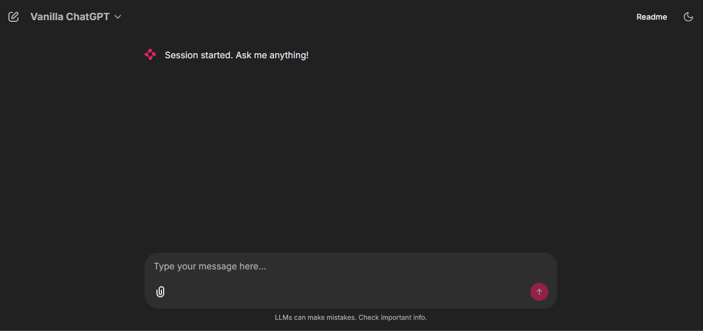
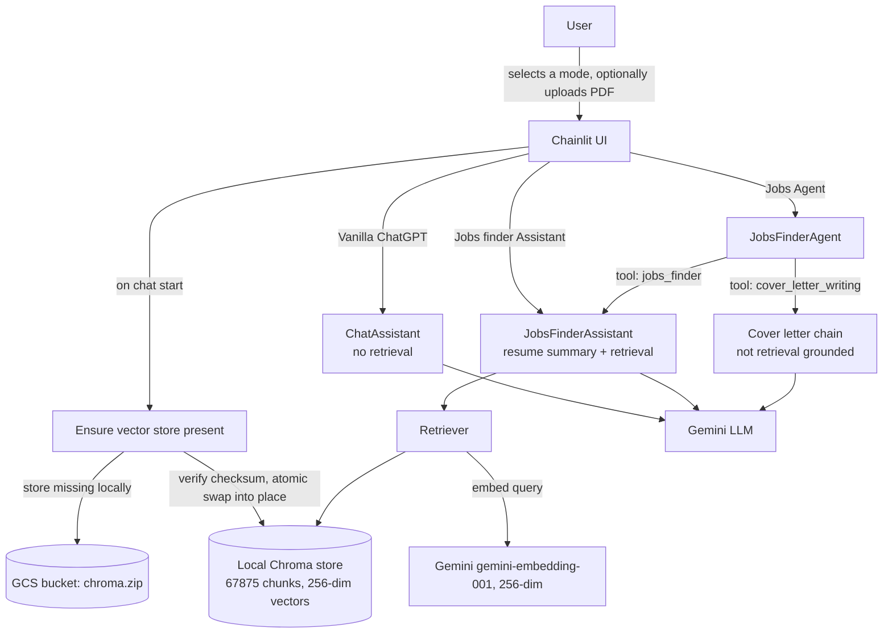

# LLM-Based Recruitment Tool

Candidates spend hours manually comparing their CV against job descriptions
and deciding what to apply for. This tool automates the comparison step: it
retrieves job postings that are semantically similar to a candidate's resume
and lets the candidate interact with the results conversationally.

**[Live Demo](https://llm-recruitment-tool.onrender.com/)**


Note: hosted on Render's free tier. The service spins down after 15 minutes
of inactivity; the first request after idle time will be slower while it
restarts and reloads the vector store.

---

## What it does

The app is a Chainlit application with three selectable modes.

### Jobs finder Assistant

Upload a resume as PDF. The assistant summarizes it, retrieves the most
semantically similar job postings from the vector store, and responds using
only those retrieved postings and the resume content. The prompt explicitly
instructs the model to say when a match is weak rather than inventing a
justification, and to say when it lacks enough information to answer. It
does not compute a numeric match score; honesty about fit is qualitative,
driven by prompt instructions, not a scoring algorithm.

### Jobs Agent

The same resume-grounded job search as above, exposed as one tool to a
tool-calling agent, plus a second tool that drafts a cover letter from the
resume and a job description. The cover letter tool is a separate LLM call
and is not constrained by the same anti-hallucination instructions as the
job search tool.

### Vanilla ChatGPT

A general-purpose conversational assistant with chat memory. It does not
read the uploaded resume, does not query the vector store, and has no
grounding constraints. It is a plain chat interface, not a resume or career
coaching tool.

---

## How it works



1. On first request, the app checks for a local Chroma store. If none is present, it downloads a zipped store from Google Cloud Storage, verifies its size and CRC checksum against the source, and swaps it into place atomically (extract to a temp directory, then move), so a failed or partial download never leaves a broken store in place.
2. A resume PDF, when uploaded, is converted to markdown by the LLM and summarized for use in retrieval queries.
3. Retrieval is a similarity search against the Chroma vector store, using Google's gemini-embedding-001 embedding model truncated to 256 dimensions.
4. The Jobs finder Assistant and the jobs_finder tool inside Jobs Agent build their responses from a prompt that is restricted to the retrieved postings and the resume text. Vanilla ChatGPT and the cover letter tool are not restricted in this way.

## Stack

Python, LangChain, ChromaDB, Google Gemini (LLM and embeddings), Chainlit,
Render, Google Cloud Storage.

LLM model in use: gemini-3.1-flash-lite-preview (configurable via
GEMINI_LLM_MODEL).

## Design decisions and tradeoffs

### Embedding dimensionality: 256 instead of the model's native 3072.

The full 67875-chunk index at native dimensionality requires roughly 850MB
of memory to load, which exceeds Render's free-tier 512MB limit. Truncating
to 256 dimensions (a supported feature of gemini-embedding-001) reduces
the in-memory index to roughly 120MB. This is a real tradeoff, not a free
optimization: truncated embeddings carry less semantic precision than the
full-dimension vectors. It was chosen to keep the deployment on free-tier
hosting rather than to maximize retrieval accuracy. Embedding cost is
unaffected, since Gemini bills by input tokens, not output dimensionality.

### Vector store hosted on Google Cloud Storage instead of committed to git.

The zipped store is currently around 166MB, and its largest individual file
exceeds GitHub's 100MB per-file limit. The app downloads it from a GCS
bucket on boot instead of shipping it in the repository.

### Static job dataset.

The 7172 job postings backing the vector store are a fixed snapshot, not a
live feed. Results reflect the state of the dataset at the time the vector
store was built, not current job board listings.

### Grounding is scoped to the job search path, not the whole app.

Anti-hallucination prompt constraints exist only where the app is answering
from retrieved data (Jobs finder Assistant, and the jobs_finder tool
inside Jobs Agent). Vanilla ChatGPT and the cover letter tool are ordinary
LLM calls without that constraint.

## Running locally

```
git clone https://github.com/Iradini/LLM-based-Recruitment-Tool
cd LLM-based-Recruitment-Tool
pip install -r requirements.txt
# copy env.example to .env and set GOOGLE_API_KEY
chainlit run backend/app.py
```


This starts the app, but the job search modes need a populated vector
store. There are two ways to get one:

* **Use a hosted store**: set GCS_BUCKET_NAME, GCS_CHROMA_BLOB, and GOOGLE_APPLICATION_CREDENTIALS in .env to point at a GCS bucket you control and have already populated. The app will download it on first request.
* **Build your own store**: run **python backend/etl.py** against the provided **dataset/jobs.csv**. This calls the Gemini embeddings API for every chunk in the dataset (67875 chunks in the full run), which is billed per token and takes a non-trivial amount of time.
  If neither is configured, the app starts with an empty vector store: it
  will run, but Jobs finder Assistant and Jobs Agent will return no matches
  until a store is populated.

## Testing


The backend has unit test coverage for the ETL pipeline, the retriever, and
each model class (*ChatAssistant*, *JobsFinderAssistant*, *JobsFinderAgent*,
the resume summarizer chain, and PDF utilities). Run with:

```
python -m pytest tests
```

## Known limitations

* Render's free tier spins down after 15 minutes idle and wipes the filesystem on restart, so the vector store re-downloads from GCS after any idle period.
* The job dataset is static; there is no live job board integration.
* Vanilla ChatGPT and the cover letter tool are not grounded in retrieved data or the resume in the same way the job search path is.
* There is no numeric or structured match score between a resume and a job posting; fit assessment is a qualitative statement generated by the LLM under prompt instructions.

## If this were a production system

* Replace the static job dataset with a live job feed API.
* Add candidate-side analytics, such as a skill gap report per role.
* Implement session persistence so users can return to previous searches.
* Extend anti-hallucination grounding to the cover letter tool.
